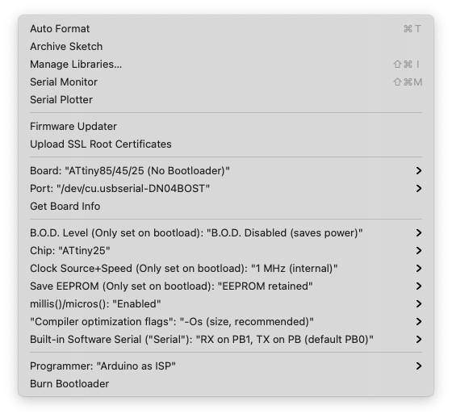

# Reprogramming the ATtiny25

As per the [instructions](instructions.pdf), if you'd like to reprogram the chip, you can setup an Arduino-as-ISP programming circuit either on a breadboard or by using a programming shield such as this one:

https://www.tindie.com/products/siktec/all-attiny-arduino-programmer-shield/

Recommended tutorial: 

https://www.instructables.com/Program-an-ATtiny-with-Arduino/

To recompile the firmware, you will need Spence Konde's [ATTinyCore](https://github.com/SpenceKonde/ATTinyCore) if you want to continue using the `tone()` function as on a normal Arduino device. 

Once you've got that installed, you'll want the upload configuration to look like this (choosing the appropriate port for your board and computer setup): 

